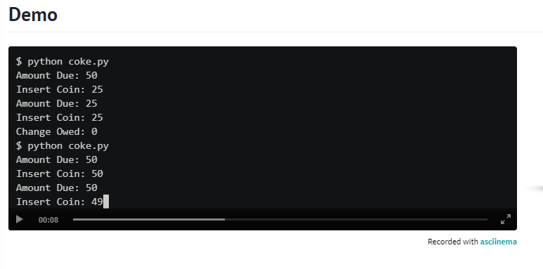

# Lesson Plan for camel
  
## Hints

* Recall that a str comes with quite a few methods, per docs.python.org/3/library/stdtypes.html#string-methods.

* Much like a list, a str is “iterable,” which means you can iterate over each of its characters in a loop. For instance, if s is a str, you could print each of its characters, one at a time, with code like:
      for c in s:
            print(c, end="")

## Demo

  

## How to test

Here’s how to test your code manually:

* Run your program with python camel.py. Type name and press Enter. Your program should output:
  name  
* Run your program with python camel.py. Type firstName and press Enter. Your program should output:
  first_name
* Run your program with python camel.py. Type preferredFirstName and press Enter. Your program should output
  preferred_first_name

# Lesson Plan for Coke Machine

Suppose that a machine sells bottles of Coca-Cola (Coke) for 50 cents and only accepts coins in these denominations: 25 cents, 10 cents, and 5 cents.

In a file called coke.py, implement a program that prompts the user to insert a coin, one at a time, each time informing the user of the amount due. Once the user has inputted at least 50 cents, output how many cents in change the user is owed. Assume that the user will only input integers, and ignore any integer that isn’t an accepted denomination.

## Hints

* no hints 

## Demo

  

  

  

  

  
## How to test

Here’s how to test your code manually:

* Run your program with python coke.py. At your Insert Coin: prompt, type 25 and press Enter. Your program should output:
  Amount Due: 25
  and continue prompting the user for coins.
* Run your program with python coke.py. At your Insert Coin: prompt, type 10 and press Enter. Your program should output:
  Amount Due: 40
  and continue prompting the user for coins.
* Run your program with python coke.py. At your Insert Coin: prompt, type 5 and press Enter. Your program should output:
  Amount Due: 45
  and continue prompting the user for coins.
* Run your program with python coke.py. At your Insert Coin: prompt, type 30 and press Enter. Your program should output:
  Amount Due: 50
  because the machine doesn’t accept 30-cent coins! Your program should then continue prompting the user for coins.
* Run your program with python coke.py. At your Insert Coin: prompt, type 25 and press Enter, then type 25 again and press Enter. Your 
  program should halt and display:
  Change Owed: 0
* Run your program with python coke.py. At your Insert Coin: prompt, type 25 and press Enter, then type 10 and press Enter. Type 25 
  again and press Enter, after which your program should halt and display:
  Change Owed: 10

# Lesson Plan for Just setting up my twttr

When texting or tweeting, it’s not uncommon to shorten words to save time or space, as by omitting vowels, much like Twitter was originally called twttr. In a file called twttr.py, implement a program that prompts the user for a str of text and then outputs that same text but with all vowels (A, E, I, O, and U) omitted, whether inputted in uppercase or lowercase.

## Hints

* Recall that a str comes with quite a few methods, per docs.python.org/3/library/stdtypes.html#string-methods.

* Much like a list, a str is “iterable,” which means you can iterate over each of its characters in a loop. For instance, if s is a str, 
  you could print each of its characters, one at a time, with code like:
  for c in s:
    print(c, end="")
## Demo

  

  

## How to test
Here’s how to test your code manually:

* Run your program with python twttr.py. Type Twitter and press Enter. Your program should output:
  Twttr   
* Run your program with python twttr.py. Type What's your name? and press Enter. Your program should output:
  Wht's yr nm?
* Run your program with python twttr.py. Type CS50 and press Enter. Your program should output
  CS50

# Lesson Plan for Vanity Plates

  

In Massachusetts, home to Harvard University, it’s possible to request a vanity license plate for your car, with your choice of letters and numbers instead of random ones. Among the requirements, though, are:

“All vanity plates must start with at least two letters.”
“… vanity plates may contain a maximum of 6 characters (letters or numbers) and a minimum of 2 characters.”
“Numbers cannot be used in the middle of a plate; they must come at the end. For example, AAA222 would be an acceptable … vanity plate; AAA22A would not be acceptable. The first number used cannot be a ‘0’.”
“No periods, spaces, or punctuation marks are allowed.”
In plates.py, implement a program that prompts the user for a vanity plate and then output Valid if meets all of the requirements or Invalid if it does not. Assume that any letters in the user’s input will be uppercase. Structure your program per the below, wherein is_valid returns True if s meets all requirements and False if it does not. Assume that s will be a str. You’re welcome to implement additional functions for is_valid to call (e.g., one function per requirement).

## Starter code or Boiler Plate Code

def main():
    plate = input("Plate: ")
    if is_valid(plate):
        print("Valid")
    else:
        print("Invalid")

def is_valid(s):
    ...

main()

## Hints

* Recall that a str comes with quite a few methods, per docs.python.org/3/library/stdtypes.html#string-methods.

* Much like a list, a str is a “sequence” (of characters), which means it can be “sliced” into shorter strings with syntax like s[i:j]. For instance, if s is "CS50", then s[0:2] would be "CS".

  

## Demo

  

  

## How to test

Here’s how to test your code manually:

* Run your program with python plates.py. Type CS50 and press Enter. Your program should output:
  Valid
* Run your program with python plates.py. Type CS05 and press Enter. Your program should output:
  Invalid
* Run your program with python plates.py. Type CS50P and press Enter. Your program should output
  Invalid
* Run your program with python plates.py. Type PI3.14 and press Enter. Your program should output
  Invalid
* Run your program with python plates.py. Type H and press Enter. Your program should output
  Invalid
* Run your program with python plates.py. Type OUTATIME and press Enter. Your program should output
  Invalid

# Lesson Plan for Nutrition Facts

The U.S. Food & Drug Adminstration (FDA) offers downloadable/printable posters that “show nutrition information for the 20 most frequently consumed raw fruits … in the United States. Retail stores are welcome to download the posters, print, display and/or distribute them to consumers in close proximity to the relevant foods in the stores.”

In a file called nutrition.py, implement a program that prompts consumers users to input a fruit (case-insensitively) and then outputs the number of calories in one portion of that fruit, per the FDA’s poster for fruits, which is also available as text. Capitalization aside, assume that users will input fruits exactly as written in the poster (e.g., strawberries, not strawberry). Ignore any input that isn’t a fruit.

## Hints

* Rather than use a conditional with 20 Boolean expressions, one for each fruit, better to use a dict to associate a fruit with its calories!

* If k is a str and d is a dict, you can check whether k is a key in d with code like:
  if k in d:
    ...
* Take care to output the fruit’s calories, not calories from fat!
  
## Demo

  

## How to test
Here’s how to test your code manually:

* Run your program with python nutrition.py. Type Apple and press Enter. Your program should output:
  Calories: 130   
* Run your program with python nutrition.py. Type Avocado and press Enter. Your program should output:
  Calories: 50
* Run your program with python nutrition.py. Type Sweet Cherries and press Enter. Your program should output
  Calories: 100
* Run your program with python nutrition.py. Type Tomato and press Enter. Your program should output nothing.
Be sure to try other fruits and vary the casing of your input. Your program should behave as expected, case-insensitively. 

